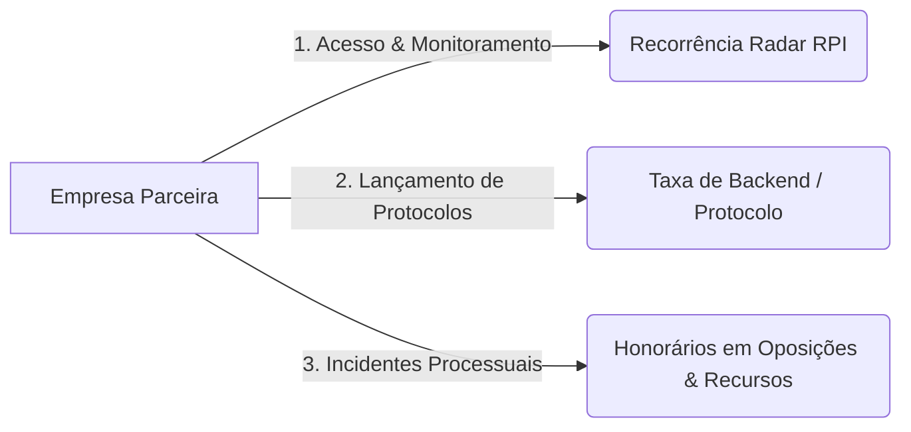

# 🚀 01 - Modelo de Negócio B2B: O "Programa de Afiliados Reverso"

## 1. O Que É o Modelo?
Em vez de vender registro de marcas para o cliente final (B2C) disputando leilão sangrento no Google Ads, nos posicionamos como a **infraestrutura tecnológica e backend jurídico para empresas consolidadas de registro de marcas, agências de branding e contabilidades**.

### A Inversão Genial:
- **Eles pagam o Google Ads** e o tráfego pago.
- **Eles mantêm o time comercial** ligando e fechando clientes finais.
- **Eles atendem o cliente leigo** no WhatsApp.
- **ELES PAGAM A NOSSA PLATAFORMA** para lançar o protocolo na dashboard e garantir a condução técnica no INPI.

---

## 2. Comparativo Brutal: B2C vs. B2B

| Métrica | Modelo B2C Tradicional | Nosso Modelo B2B |
| :--- | :--- | :--- |
| **Esforço de Venda** | Vender 100x para 100 clientes PF/PJs diferentes. | Fechar **10 a 20 parcerias** estratégicas. |
| **Custo de Aquisição (CAC)** | R$ 150 a R$ 350 por cliente no Google/Meta Ads. | **R$ 0,00** (Prospecção ativa no LinkedIn Sales Navigator). |
| **Volume Processual** | 10 a 20 marcas/mês. | **150 a 400 marcas/mês** no piloto automático. |
| **Margem Líquida** | 40% a 50% (o tráfego come o lucro). | **90% a 95%** de margem limpa. |
| **Retenção (LTV)** | Transacional (cliente registra 1 vez e some). | **Recorrente perpétuo** (o parceiro envia novas marcas todo mês). |

---

## 3. As 3 Linhas de Faturamento

1. **Taxa de Protocolo / Backend:** R$ 150 a R$ 300 por processo novo cadastrado.
2. **Assinatura Recorrente da Dashboard / Radar RPI:** R$ 297 a R$ 997/mês por parceiro para monitoramento e ferramentas de IA.
3. **Serviços Jurídicos Avulsos de Alto Ticket:** R$ 600 a R$ 1.200 por oposição, manifestação ou recurso interposto.

---

## 4. O Tamanho do Mercado em 2026
- Mais de **500.000 novos pedidos de registro de marcas por ano** no INPI.
- Capturando apenas **0,05%** dessa fatia através de 15 parceiros = **250 marcas/mês**.
- Faturamento estimado na Fase 1: **R$ 60.000 a R$ 100.000+/mês**.
