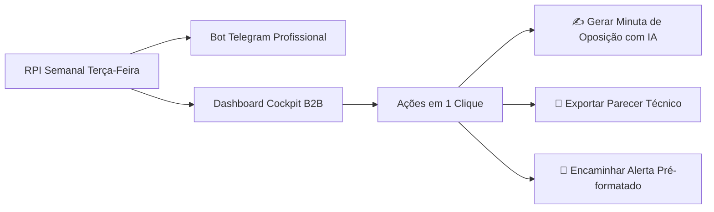

# 🖥️ Especificação da Dashboard (Cockpit B2B para Profissionais de PI)

> **Público Exclusivo:** Advogados especialistas, Agentes da Propriedade Industrial (APIs), Procuradores e Criadores de Marcas (Branding/Naming). **Não é voltada para o cliente final.** É uma ferramenta de alta produtividade, inteligência operacional e contencioso administrativo.

---

## 🧭 1. Painel Principal (Cockpit Operacional do Profissional)



### 📊 1.1. Cards de Comando no Topo (Métricas Críticas)

| Card | Descrição Operacional | Ação Imediata do Profissional |
| :--- | :--- | :--- |
| **🚨 Prazos Fatais Iminentes (60 dias)** | Oposições, Manifestações, Cumprimento de Exigência e Recursos. | Abre lista com filtros de urgência regressiva (dias restantes) |
| **⚡ Radar de Colidências da RPI** | Marcas publicadas na última terça que ameaçam o portfólio monitorado. | Abrir comparativo fonético/gráfico e disparar Minuta de Oposição |
| **🤖 Status do Bot Telegram** | Conexão ativa com canais/grupos privados do escritório. | Testar envio / Configurar filtros de alerta |
| **💰 Decênios & Taxas Próximas** | Marcas concedidas que entraram no prazo de prorrogação decenal. | Gerar relatório de oportunidade comercial |
| **💡 Naming & Viabilidade em Fila** | Projetos de naming em andamento com validação prévia de registrabilidade. | Acessar resultados de disponibilidade |

---

## 📲 2. Integração com Telegram Bot (Notificações em Tempo Real)

Em vez de depender de e-mails lentos, o profissional recebe **notificações instantâneas e acionáveis via Telegram Bot** assim que a RPI é processada nas terças-feiras.

### 🤖 2.1. Tipos de Alertas Enviados no Telegram:

1. **Alerta de Colidência Grave (com Botões de Ação Inline):**
   ```text
   ⚠️ ALERTA DE COLIDÊNCIA RPI 2825
   -----------------------------------
   Sua Marca Monitorada: NEXUS PROTECT (Classe 42)
   Marca Publicada: NEXUS PRO (Classe 42)
   Processo: 934821902 | Titular: Terceiro Ltda
   Similaridade Fonética: 94% | Risco: ALTO (Art. 124, XIX)
   Prazo Oposição: 60 dias (até 28/10/2026)
   -----------------------------------
   [ ✍️ Gerar Minuta de Oposição ]  [ 📄 Ver Comparativo na Dash ]
   ```

2. **Alerta de Despachos Próprios da Carteira:**
   - `IPAS 270` Concessão/Deferimento: Notifica para emitir a GRU de pagamento dos primeiros 10 anos.
   - `IPAS 110` Exigência de Mérito/Formal: Notifica com o texto complementar exato do examinador.
   - `IPAS 005` Notificação de Oposição Sofrida: Inicia a contagem regressiva de 60 dias para manifestação.

3. **Comandos Interativos no Telegram (`/commands`):**
   - `/busca [nome] [classe]` — Roda uma busca instantânea de anterioridade direto pelo chat do Telegram.
   - `/prazos` — Lista todos os prazos que vencem nos próximos 7 dias.
   - `/status [num_processo]` — Traz o histórico completo do processo no INPI.

---

## 🛠️ 3. Módulos Internos da Dashboard

### 🔍 3.1. Mesa de Triagem da RPI (Terças-feiras)
- Tabela com filtros avançados: por classe Nice, tipo de colidência, titular da marca ou status.
- **Modo "Aprovação Rápida":** O advogado pode marcar a colidência como *"Ignorar (marca fraca)"* ou *"Opor (gerar minuta)"*.

### ✍️ 3.2. Copiloto de Peças Jurídicas (Editor com IA Integrada)
- Editor Rich Text com geração lado a lado:
  - Painel Esquerdo: Dados do processo da marca monitorada vs marca colidente.
  - Painel Direito: Minuta gerada pela IA com fundamentos jurídicos (Art. 124, V, VI, XIX, XXIII da LPI).
  - Exportação em `.docx` ou `.pdf` pronta para protocolo no sistema e-INPI.

### 🎨 3.3. Hub de Naming & Branding
- Interface para profissionais e agências cadastrarem briefings de novos clientes.
- Matriz de resultados com validação trifásica:
  - **INPI:** Sem marcas colidentes registradas/depositadas.
  - **Domínio:** `.com.br` e `.com` livres.
  - **Identidade:** Paletas de cores e pares tipográficos sugeridos para o pitch.
