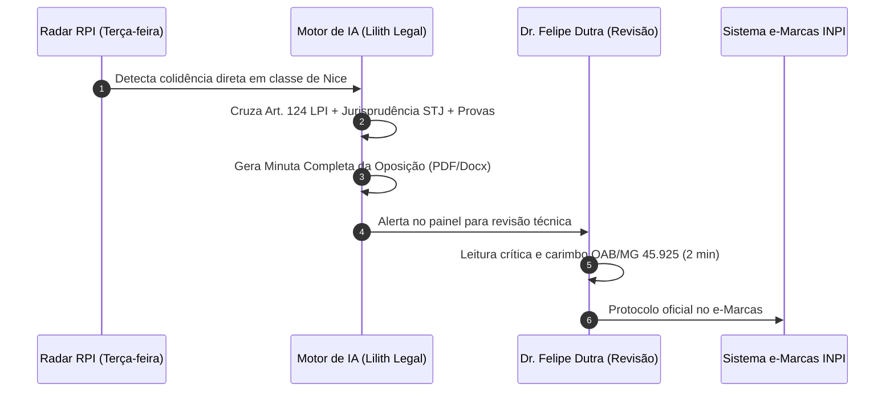

# ⚖️ 03 - Esteira de Serviços e Backend Jurídico Automatizado

## 1. O Conceito de Fábrica de Peças Jurídicas
O gargalo dos escritórios tradicionais é o tempo que advogados humanos levam redigindo petições repetitivas. No nosso modelo, **a IA atua como assistente hiper-rápido de redação técnica e o advogado especialista valida e assina em 2 minutos**.

---

## 2. Pipeline de Oposições e Defesas Automatizadas

---

## 3. Catálogo de Peças Técnicas Processuais
1. **Oposição a Pedido de Terceiros (Art. 158 da LPI):** Fundamentada em anterioridade, notoriedade ou má-fé comercial.
2. **Manifestação à Oposição Sofrida:** Defesa técnica demonstrando coexistência pacífica, distinção de ramos e especialidade de mercado.
3. **Cumprimento de Exigência Formal/Mérito:** Adequação de especificação ou apresentação de documentos no prazo fatal de 60 dias.
4. **Recurso contra Indeferimento (Art. 212 da LPI):** Peça recursal robusta contra decisões equivocadas dos examinadores do INPI.
5. **Processo Administrativo de Nulidade (PAN):** Pedido de anulação de marcas registradas irregularmente.

---

## 4. Margem e Lucro por Peça
- **Custo de Produção (IA + Infraestrutura):** R$ 0,50 a R$ 2,00 por minuta gerada.
- **Tempo de Advocacia (Revisão):** ~2 a 5 minutos por peça.
- **Preço cobrado da Empresa Parceira:** R$ 600 a R$ 900.
- **Margem Bruta:** **+99%**.
