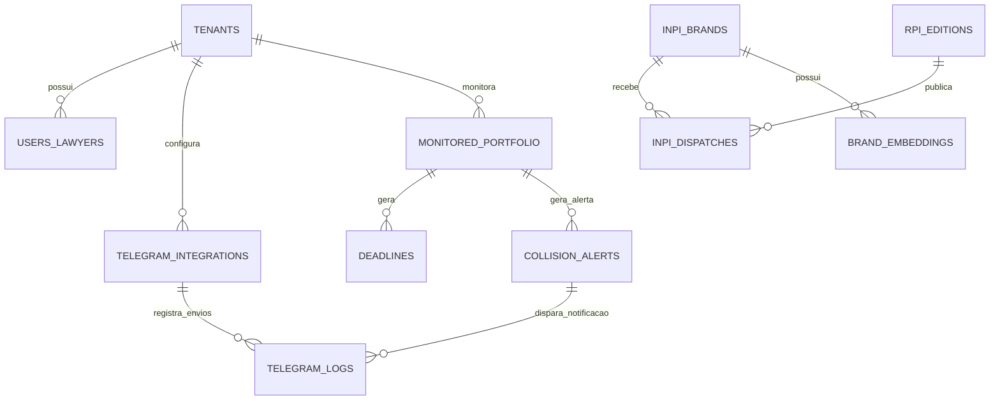

# 🗄️ Schema de Banco de Dados — PostgreSQL + pgvector (INPI + Cockpit B2B)

---

## 📐 1. Diagrama Entidade-Relacionamento Atualizado



---

## 🛠️ 2. Tabelas do Sistema

### 2.1. Configuração e Logs do Telegram Bot

```sql
-- Configuração do Bot de Telegram por Escritório/Profissional
CREATE TABLE telegram_integrations (
    id UUID PRIMARY KEY DEFAULT gen_random_uuid(),
    tenant_id UUID REFERENCES tenants(id) ON DELETE CASCADE,
    telegram_chat_id VARCHAR(100) NOT NULL, -- ID do canal/grupo ou chat privado do advogado
    telegram_bot_token VARCHAR(255),        -- Token dedicado ou usa o bot oficial do sistema
    is_active BOOLEAN DEFAULT TRUE,
    notify_collisions BOOLEAN DEFAULT TRUE, -- Notificar colidências de terceiros
    notify_dispatches BOOLEAN DEFAULT TRUE, -- Notificar despachos de marcas próprias
    notify_deadlines BOOLEAN DEFAULT TRUE,  -- Notificar vencimento de prazos
    min_collision_score NUMERIC(5,2) DEFAULT 75.00, -- Apenas alertas acima de 75%
    created_at TIMESTAMP WITH TIME ZONE DEFAULT NOW()
);

-- Histórico de Alertas e Notificações Enviadas via Telegram
CREATE TABLE telegram_logs (
    id UUID PRIMARY KEY DEFAULT gen_random_uuid(),
    integration_id UUID REFERENCES telegram_integrations(id) ON DELETE CASCADE,
    alert_type VARCHAR(50) NOT NULL,        -- collision, dispatch, deadline, naming_ready
    reference_id UUID,                      -- ID da colisão ou do prazo
    message_sent TEXT NOT NULL,
    inline_keyboard_payload JSONB,
    status VARCHAR(20) DEFAULT 'sent',      -- sent, failed, delivered
    telegram_message_id VARCHAR(100),
    sent_at TIMESTAMP WITH TIME ZONE DEFAULT NOW()
);
```

### 2.2. Portfólio de Marcas Monitoradas pelo Profissional

```sql
-- Marcas sob tutela do escritório (clientes do profissional)
CREATE TABLE monitored_portfolio (
    id UUID PRIMARY KEY DEFAULT gen_random_uuid(),
    tenant_id UUID REFERENCES tenants(id) ON DELETE CASCADE,
    client_name VARCHAR(255) NOT NULL,      -- Nome do cliente final (apenas para organização do advogado)
    client_document VARCHAR(30),            -- CPF/CNPJ
    inpi_process_number VARCHAR(15),        -- Número do processo no INPI (opcional se for marca não depositada)
    brand_name VARCHAR(255) NOT NULL,
    brand_name_normalized VARCHAR(255) NOT NULL,
    nice_classes INT[] NOT NULL,            -- Classes Nice protegidas
    vigency_expiration_date DATE,           -- Data final do decênio
    monitoring_status VARCHAR(30) DEFAULT 'active', -- active, paused, archived
    created_at TIMESTAMP WITH TIME ZONE DEFAULT NOW()
);
CREATE INDEX idx_portfolio_brand_name ON monitored_portfolio(brand_name_normalized);
```

### 2.3. Base do INPI & Vetores

```sql
-- RPI e Marcas Oficiais
CREATE TABLE rpi_editions (
    id SERIAL PRIMARY KEY,
    rpi_number INT UNIQUE NOT NULL,
    publication_date DATE NOT NULL,
    processed_at TIMESTAMP WITH TIME ZONE DEFAULT NOW()
);

CREATE TABLE inpi_brands (
    id BIGSERIAL PRIMARY KEY,
    process_number VARCHAR(15) UNIQUE NOT NULL,
    brand_name VARCHAR(255) NOT NULL,
    brand_name_normalized VARCHAR(255) NOT NULL,
    brand_presentation VARCHAR(50),
    brand_nature VARCHAR(50),
    status VARCHAR(100),
    filing_date DATE,
    concession_date DATE,
    expiration_date DATE,
    holder_name VARCHAR(255),
    created_at TIMESTAMP WITH TIME ZONE DEFAULT NOW()
);
CREATE INDEX idx_inpi_brands_trgm ON inpi_brands USING gin (brand_name_normalized gin_trgm_ops);

CREATE TABLE brand_embeddings (
    id BIGSERIAL PRIMARY KEY,
    brand_id BIGINT REFERENCES inpi_brands(id) ON DELETE CASCADE,
    embedding VECTOR(768),
    phonetic_code VARCHAR(50)
);
CREATE INDEX idx_brand_vector ON brand_embeddings USING ivfflat (embedding vector_cosine_ops) WITH (lists = 200);
```
