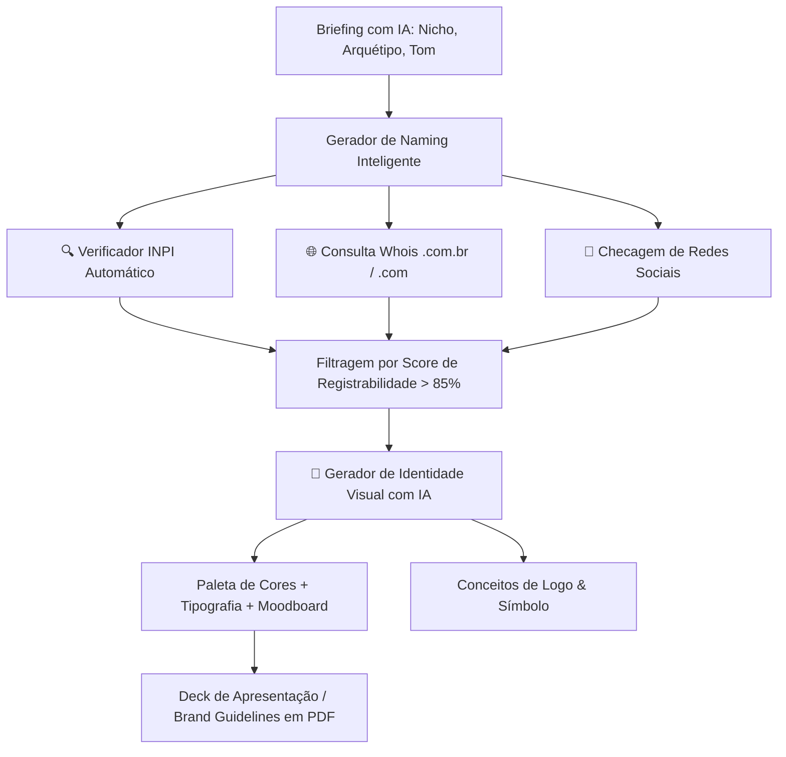

# 🎨 MarcaStudio AI — Naming, Branding & Identidade Visual 100% Registrável

> Módulo integrado de geração de Nomes de Marca com verificação prévia automática no INPI, disponibilidade de domínios, psicologia de cores e identidade visual com IA.

---

## 💡 1. Por que essa ideia é excelente (A "Dor de Ouro" do Mercado)

O maior problema de agências de branding e designers hoje é:
> **"Criar uma marca linda, registrar o domínio, aprovar com o cliente, e na hora de registrar no INPI... a marca é indeferida por anterioridade (Art. 124 da LPI)."**

Integrar **Naming + Branding + Validação em Tempo Real no INPI** transforma o seu escritório ou o usuário da plataforma em uma solução *end-to-end* (do conceito inicial ao certificado de registro).

---

## 🚀 2. Recursos do Módulo MarcaStudio AI

---

## 🛠️ 3. Ferramentas e Funcionalidades Detalhadas

### 🔤 3.1. Gerador de Naming Juridicamente Viável
- **Parâmetros de Entrada:**
  - Nicho de atuação (ex: FinTech, Cosméticos, Moda).
  - Classes Nice pretendidas (ex: 09, 35, 42).
  - Estilo de Nome:
    - *Neologismo / Fantasia* (ex: Nubank, Spotify) — **Maior índice de deferimento no INPI**.
    - *Evocativo / Sugestivo* (ex: Netflix, Papelaria Criativa).
    - *Composto / Aglutinado* (ex: FedEx).
    - *Acrônimos / Siglas*.
- **Pipeline de Filtragem Prévia:**
  1. A IA gera 50 opções de nomes.
  2. O sistema roda a busca fonética/gráfica instantânea contra o banco do INPI.
  3. **Descarta automaticamente** nomes com risco de colidência com marcas já registradas.
  4. Consulta disponibilidade de domínio `.com.br` (Registro.br) e `@handles` do Instagram/LinkedIn.
  5. Apresenta ao usuário apenas o **Top 5 nomes com alta probabilidade de registro no INPI**.

---

### 🎨 3.2. Gerador de Branding & Psicologia das Cores
- **Arquétipos de Marca:** A IA recomenda paletas baseadas nos 12 arquétipos de Jung (O Herói, O Mago, O Rebelde, O Criador, etc.).
- **Paletas Harmônicas com Códigos Hex:**
  - Cor Primária, Secundária, Acentos e Neutros (com contraste WCAG para acessibilidade).
  - Explicação semiótica/psicológica de cada cor para justificar no pitch ao cliente.
- **Sugestão de Tipografia:** Pares de fontes (Google Fonts) para títulos e corpo de texto.
- **Brand Persona & Tom de Voz:** Definição das diretrizes de comunicação da marca.

---

### 📑 3.3. Manual de Identidade Visual & Parecer em 1-Click
- Gera um **Brand Book / Brand Guidelines em PDF** completo:
  - Significado do Nome.
  - Certidão de Pré-Viabilidade do INPI atestando que o nome está liberado.
  - Paleta de Cores, Fontes e Aplicações.
  - Valor cobrado pelo escritório para o protocolo imediato do registro.
