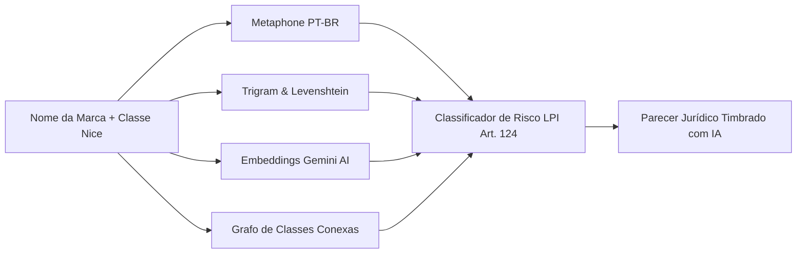

# 🧠 Recursos, Inteligência Artificial & Automações Jurídicas

Detalhamento técnico dos algoritmos de IA, pipelines de dados e ferramentas de produtividade para o advogado especialista em marcas.

---

## 🔬 1. O Algoritmo de Viabilidade Preditiva (4 Pilares)

A IA analisa qualquer marca pretendida contra os milhões de registros do INPI utilizando um score ponderado:

$$\text{Score de Risco} = (0.35 \times S_{\text{fonética}}) + (0.25 \times S_{\text{gráfica}}) + (0.20 \times S_{\text{ideológica}}) + (0.20 \times S_{\text{afinidade}})$$

### 1.1. Detalhamento dos Pilares:
1. **Semelhança Fonética (Metaphone PT-BR adaptado):** Identifica homofonias e quase-homofonias (ex: `Lumiére` / `Lumiar`, `Klin` / `Clean`).
2. **Semelhança Gráfica (Trigram GIN Index + Levenshtein Distance):** Detecta anagramas, inclusão/exclusão de letras e prefixos/sufixos comuns.
3. **Semelhança Ideológica (Gemini Embeddings + Semantic Search):** Cruza significados, sinônimos e traduções (ex: `Star Shoes` vs `Sapatos Estrela`).
4. **Afinidade Mercadológica (Knowledge Graph de Classes):** Entende conflito entre classes conexas (ex: Classe 25 - Vestuário e Classe 35 - Comércio de Roupas).

---

## ⚡ 2. Copiloto de Redação Jurídica (Legal Prompt Engineering)

O módulo de redação utiliza modelos de ponta com **System Prompts customizados para Direito Marcário Brasileiro**:

### 📄 Casos de Uso com Minutas Automáticas:
1. **Petição de Oposição a Pedido de Registro:**
   - Detecta o titular da anterioridade e fundamenta o direito de preferência / exclusividade.
   - Aplica os critérios da **Diretriz de Exame de Marcas do INPI** (Aproveitamento parasitário, risco de confusão ou associação indevida).
2. **Manifestação a Oposição:**
   - Busca teses de convivência pacífica no mercado, marcas evocativas (termos fracos/comuns) e ausência de colidência mercadológica.
3. **Recurso contra Indeferimento:**
   - Estrutura argumentos com base na distintividade secundária (*Secondary Meaning*) ou descaracterização do Art. 124, VI/VIII/XIX.
4. **Parecer de Viabilidade Comercial (para o cliente do escritório):**
   - Linguagem clara, executiva e persuasiva (com semáforo Verde/Amarelo/Vermelho) para facilitar o fechamento do contrato de assessoria.

---

## 🤖 3. Robô Sentinela da RPI (Pipeline Semanal)

- **Horário de Disparo:** Toda terça-feira às 06:00 AM (assim que o INPI publica a RPI).
- **Processamento:**
  1. Download e descompactação do arquivo XML da RPI.
  2. Parse de todos os despachos e pedidos depositados.
  3. Cruzamento automático contra todas as `monitored_brands` da base de clientes.
  4. Cálculo de colidência para novos pedidos de terceiros.
  5. Criação automática de prazos na tabela `deadlines`.
  6. Envio de resumo executivo via WhatsApp/E-mail para o advogado com as marcas ameaçadas.
